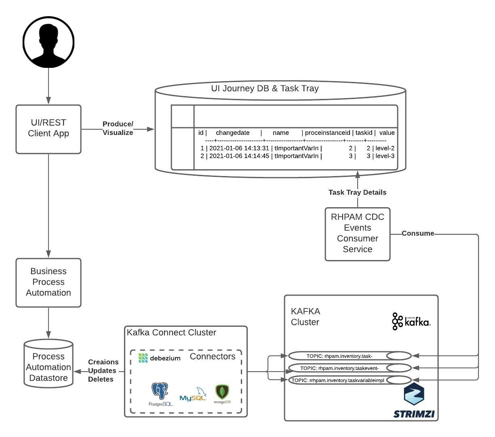

= rhpam-cdc-service
:toc:

Retrieves RHPAM Events from KAFKA Topic (defined in search for `@Incoming`) created by DEBEZIUM CDC connectors and creates Task Tray/Monitoring view

== RHPAM TaskVariableImpl CDC Message 

* Schema

	{
	  "schema": {
	    "type": "struct",
	    "fields": [
	      {
		"type": "struct",
		"fields": [
		  {
		    "type": "int64",
		    "optional": false,
		    "field": "id"
		  },
		  {
		    "type": "int64",
		    "optional": true,
		    "name": "io.debezium.time.Timestamp",
		    "version": 1,
		    "field": "modificationDate"
		  },
		  {
		    "type": "string",
		    "optional": true,
		    "field": "name"
		  },
		  {
		    "type": "string",
		    "optional": true,
		    "field": "processId"
		  },
		  {
		    "type": "int64",
		    "optional": true,
		    "field": "processInstanceId"
		  },
		  {
		    "type": "int64",
		    "optional": true,
		    "field": "taskId"
		  },
		  {
		    "type": "int32",
		    "optional": true,
		    "field": "type"
		  },
		  {
		    "type": "string",
		    "optional": true,
		    "field": "value"
		  }
		],
		"optional": true,
		"name": "rhpam6.inventory.TaskVariableImpl.Value",
		"field": "before"
	      },
	      {
		"type": "struct",
		"fields": [
		  {
		    "type": "int64",
		    "optional": false,
		    "field": "id"
		  },
		  {
		    "type": "int64",
		    "optional": true,
		    "name": "io.debezium.time.Timestamp",
		    "version": 1,
		    "field": "modificationDate"
		  },
		  {
		    "type": "string",
		    "optional": true,
		    "field": "name"
		  },
		  {
		    "type": "string",
		    "optional": true,
		    "field": "processId"
		  },
		  {
		    "type": "int64",
		    "optional": true,
		    "field": "processInstanceId"
		  },
		  {
		    "type": "int64",
		    "optional": true,
		    "field": "taskId"
		  },
		  {
		    "type": "int32",
		    "optional": true,
		    "field": "type"
		  },
		  {
		    "type": "string",
		    "optional": true,
		    "field": "value"
		  }
		],
		"optional": true,
		"name": "rhpam6.inventory.TaskVariableImpl.Value",
		"field": "after"
	      },
	      {
		"type": "struct",
		"fields": [
		  {
		    "type": "string",
		    "optional": false,
		    "field": "version"
		  },
		  {
		    "type": "string",
		    "optional": false,
		    "field": "connector"
		  },
		  {
		    "type": "string",
		    "optional": false,
		    "field": "name"
		  },
		  {
		    "type": "int64",
		    "optional": false,
		    "field": "ts_ms"
		  },
		  {
		    "type": "string",
		    "optional": true,
		    "name": "io.debezium.data.Enum",
		    "version": 1,
		    "parameters": {
		      "allowed": "true,last,false"
		    },
		    "default": "false",
		    "field": "snapshot"
		  },
		  {
		    "type": "string",
		    "optional": false,
		    "field": "db"
		  },
		  {
		    "type": "string",
		    "optional": true,
		    "field": "table"
		  },
		  {
		    "type": "int64",
		    "optional": false,
		    "field": "server_id"
		  },
		  {
		    "type": "string",
		    "optional": true,
		    "field": "gtid"
		  },
		  {
		    "type": "string",
		    "optional": false,
		    "field": "file"
		  },
		  {
		    "type": "int64",
		    "optional": false,
		    "field": "pos"
		  },
		  {
		    "type": "int32",
		    "optional": false,
		    "field": "row"
		  },
		  {
		    "type": "int64",
		    "optional": true,
		    "field": "thread"
		  },
		  {
		    "type": "string",
		    "optional": true,
		    "field": "query"
		  }
		],
		"optional": false,
		"name": "io.debezium.connector.mysql.Source",
		"field": "source"
	      },
	      {
		"type": "string",
		"optional": false,
		"field": "op"
	      },
	      {
		"type": "int64",
		"optional": true,
		"field": "ts_ms"
	      },
	      {
		"type": "struct",
		"fields": [
		  {
		    "type": "string",
		    "optional": false,
		    "field": "id"
		  },
		  {
		    "type": "int64",
		    "optional": false,
		    "field": "total_order"
		  },
		  {
		    "type": "int64",
		    "optional": false,
		    "field": "data_collection_order"
		  }
		],
		"optional": true,
		"field": "transaction"
	      }
	    ],
	    "optional": false,
	    "name": "rhpam6.inventory.TaskVariableImpl.Envelope"
	  },
	  "payload": {
	    "before": null,
	    "after": {
	      "id": 2,
	      "modificationDate": 1607680532000,
	      "name": "tImportantVarIn",
	      "processId": "ht-basics.simple-ht",
	      "processInstanceId": 2,
	      "taskId": 2,
	      "type": 0,
	      "value": "Level-0"
	    },
	    "source": {
	      "version": "1.3.1.Final",
	      "connector": "mysql",
	      "name": "rhpam6",
	      "ts_ms": 1607680532000,
	      "snapshot": "false",
	      "db": "inventory",
	      "table": "TaskVariableImpl",
	      "server_id": 223344,
	      "gtid": null,
	      "file": "mysql-bin.000003",
	      "pos": 123187,
	      "row": 0,
	      "thread": null,
	      "query": null
	    },
	    "op": "c",
	    "ts_ms": 1607680532198,
	    "transaction": null
	  }
	}

== Task Tray DB Structure

	taskdetails=> select * from taskvariables;
	 id |     changedate      |      name       | proceinstanceid | taskid |  value  
	----+---------------------+-----------------+-----------------+--------+---------
	  1 | 2021-01-06 14:13:31 | tImportantVarIn |               2 |      2 | level-2
	  2 | 2021-01-06 14:14:45 | tImportantVarIn |               3 |      3 | level-3

== RHPAM Task Variable Events CDC to Kafka Setup

For more detailed setup information, decisions, debugging look into link:++https://github.com/skoussou/cdc-playground/tree/main/rhpam-cdc-service/RHPAM Task Variable Events CDC to Kafka.pdf++[RHPAM Task Variable Events CDC to Kafka.pdf]

=== Prepare Environment

Prerequisite is access to OCP Cluster with capability to

a) Install Strimzi/AMQ Streams operator from console

b) Create KAFKA CRD to create the KAFKA Cluster (see xref:anchor-3[Appendix B - Kafka Cluster Setup])

c) Create KAFKA AMQ Streams/KAFKA Connect (see xref:anchor-4[Appendix B - Kafka Connect with Debezium plugins IMAGE Creation and Deployment])

=== Prepare Applications

==== Create and Deploy KIE Server (Spring Boot Based) Service

1. Build the KJAR (in .m2 or MAVEN Artifact Repository)

	https://github.com/skoussou/JBossAutomationPlayground/tree/master/example-kjars/simple-process-kjar

2. Build and Deploy KIE Server Service based on the KJAR

* *Note:* Utilize Debezium Based MYSQL Database rather than OCP 8.x database (With OCP 8.x DB the GLOBAL_VARIABLES table is missing so the following didn’t work with debezium)
* DATABASE 5.7 with DEBEZIUM based image (Used and works)

	oc new-app --name=dbz-14-pam-mysql debezium/example-mysql:1.4 -e=MYSQL_ROOT_PASSWORD=debezium  -e=MYSQL_USER=jbpm -e=MYSQL_PASSWORD=jbpm

3. Using SB RHPAM based on repo `https://github.com/skoussou/springboot-business-app.git` configure the mysql DB above details in `application-openshift.properties` and the KJAR details in `business-application-service.xml` and then

4. Deploy it

	mvn clean package -DskipTests=true -P openshift -Dmaven.artifact.threads=50 -s ~/.m2/settings.xml
	mvn oc:deploy -Djkube.namespace=dev-demo -DskipTests=true -P openshift -Dmaven.artifact.threads=50 -s ~/.m2/settings.xml

5. Create process and tasks content (This will create db events from RHPAM.)

	curl -u user:user -X POST --header 'Content-Type: application/json' --header 'Accept: application/json' -d '{ "taskOwner" : "user", "pImporantVar" : "level-2"}' 'http://<ROUTE-TO-APP>/rest/server/containers/simple-process-kjar-1.0.8/processes/ht-basics.simple-ht/instances'

==== Create and Deploy KAFKA CONNECT/DEBEZIUM Connector (CONFIGURATION/USAGE)

===== Inspecting Kafka Connect Service Debezium Connector

1. Choose the kafka connect service by running 

	oc get svc -l app.kubernetes.io/name=kafka-connect -o json | jq -r '.items[] | .metadata.name'

2. Export the following environment properties

	export DEBEZIUM_CONNECT_SVC=debezium-connect-connect-api
	export CONNECTOR=rhpam-connector

3. Get all connectors:

	GET /connectors Get a list of active connectors

* request:
	
	oc exec -i events-cluster-kafka-0 -- curl -X GET \
	-H "Accept:application/json" \
	-H "Content-Type:application/json" \
	http://$DEBEZIUM_CONNECT_SVC:8083/connectors

* response:

	HTTP/1.1 200 OK
	Accept:application/json
	[""]

===== Create Debezium Connector

B.  Create Debezium Connector - Using CR (Custom Resource)

* See xref:anchor-4[Appendix B - Kafka Connect with Debezium plugins IMAGE Creation and Deployment]

	oc apply -f - << EOF
	apiVersion: kafka.strimzi.io/v1alpha1
	kind: KafkaConnector
	metadata:
	  name: rhpam-connector
	  namespace: dev-demo
	  labels:
	    strimzi.io/cluster: debezium-connect
	    app: rhpam   
	spec:
	  class: io.debezium.connector.mysql.MySqlConnector
	  tasksMax: 1
	  config:
	    database.hostname: 172.30.88.1
	    database.port: 3306
	    database.user: root
	    database.password: debezium
	    database.server.id: 184054
	    database.server.name: rhpam
	    database.include.list: jbpm
	    table.include.list: 'jbpm.Task,jbpm.TaskEvent,jbpm.TaskVariableImpl'
	    database.history.kafka.bootstrap.servers: events-cluster-kafka-bootstrap:9092
	    database.history.kafka.topic: schema-changes.rhpam
	EOF

* From Operator Console

	apiVersion: kafka.strimzi.io/v1alpha1
	kind: KafkaConnector
	metadata:
	  name: rhpam-connector
	  namespace: dev-demo
	  labels:
	    strimzi.io/cluster: debezium-connect
	    app: rhpam    
	spec:
	  class: io.debezium.connector.mysql.MySqlConnector
	  tasksMax: 1
	  config:
	    database.hostname: dbz-14-pam-mysql
	    database.port: 3306
	    database.user: root
	    database.password: debezium
	    database.server.id: 184054
	    database.server.name: rhpam
	    database.include.list: inventory
	    table.include.list: 'inventory.Task,inventory.TaskEvent,inventory.TaskVariableImpl'
	    database.history.kafka.bootstrap.servers: events-cluster-kafka-bootstrap:9092
	    database.history.kafka.topic: schema-changes.rhpam
	    key.converter.schemas.enable: false
	    value.converter.schemas.enable: false

* Check the messages published per table in each topic

.Kafka Published Messages Inspection
====
[width="100%",options="header"]
|===
| POD | DB Table | Command
| oc rsh events-cluster-kafka-0
| Task
| ./kafka-console-consumer.sh --bootstrap-server localhost:9092 --topic rhpam.inventory.TaskEvent --from-beginning
| oc rsh events-cluster-kafka-1
| TaskEvent
| ./kafka-console-consumer.sh --bootstrap-server localhost:9092 --topic rhpam.inventory.Task  --from-beginning
| oc rsh events-cluster-kafka-2
| TaskVariableImpl
| ./kafka-console-consumer.sh --bootstrap-server localhost:9092 --topic rhpam.inventory.TaskVariableImpl  --from-beginning
|
|===
====

===== Creating Consumer of CDC Kafka Messages & Storage in DB

Code at: https://github.com/skoussou/cdc-playground/tree/main/rhpam-cdc-service[rhpam-cdc-service/src] GIT Repository

====== Create App DB to store APP view of TaskVariable Events

	oc new-app --template=postgresql-persistent -p DATABASE_SERVICE_NAME=taskdetails-postgresql -p POSTGRESQL_USER=postgresrhpamuser -p POSTGRESQL_PASSWORD=postgresrhpampwd -p POSTGRESQL_DATABASE=taskdetails -l app=task-details-db

* Inspect PSQL Setup
** Enter POD

	oc rsh <taskdetails-postgresql Pod name>

** Authenticate to DB

	psql -U postgresrhpamuser -W postgresrhpampwd -d taskdetails

** Check DBs

	taskdetails=> \l
		                              List of databases
	    Name     |       Owner       | Encoding |  Collate   |   Ctype    |   Access privileges   
	-------------+-------------------+----------+------------+------------+-----------------------
	 postgres    | postgres          | UTF8     | en_US.utf8 | en_US.utf8 | 
	 taskdetails | postgresrhpamuser | UTF8     | en_US.utf8 | en_US.utf8 | 
	 template0   | postgres          | UTF8     | en_US.utf8 | en_US.utf8 | =c/postgres          +
		     |                   |          |            |            | postgres=CTc/postgres
	 template1   | postgres          | UTF8     | en_US.utf8 | en_US.utf8 | =c/postgres          +
		     |                   |          |            |            | postgres=CTc/postgres
	(4 rows)

====== Configure & Deploy Quarkus CDC Cosumer App

Configure App https://github.com/skoussou/cdc-playground/tree/main/rhpam-cdc-service/src/main/resources/application.properties[application.properties]

	quarkus.datasource.url=jdbc:postgresql://taskdetails-postgresql:5432/taskdetails?currentSchema=public
	quarkus.datasource.username=postgresrhpamuser
	quarkus.datasource.password=postgresrhpampwd
	quarkus.hibernate-orm.database.generation=drop-and-create
	quarkus.hibernate-orm.dialect=org.hibernate.dialect.PostgreSQLDialect
	quarkus.hibernate-orm.log.sql=true
	mp.messaging.incoming.taskdetails.connector=smallrye-kafka
	#mp.messaging.incoming.orders.topic=Order.events
	#mp.messaging.incoming.orders.bootstrap.servers=kafka:9092
	mp.messaging.incoming.taskdetails.topic=rhpam.jbpm.TaskVariableImpl
	mp.messaging.incoming.taskdetails.bootstrap.servers=events-cluster-kafka-bootstrap:9092
	mp.messaging.incoming.taskdetails.group.id=taskdetails-service
	mp.messaging.incoming.taskdetails.key.deserializer=org.apache.kafka.common.serialization.StringDeserializer
	mp.messaging.incoming.taskdetails.value.deserializer=org.apache.kafka.common.serialization.StringDeserializer
	...

* Deploy

	 mvn  clean package -Dquarkus.kubernetes.deploy=true -Dquarkus.openshift.expose=true -Dquarkus.kubernetes-client.trust-certs=true

* Check DB Table Relations created

	taskdetails=> \dt
		          List of relations
	 Schema |      Name       | Type  |       Owner       
	--------+-----------------+-------+-------------------
	 public | consumedmessage | table | postgresrhpamuser
	 public | shipment        | table | postgresrhpamuser
	 public | taskvariables   | table | postgresrhpamuser

* Check consumed TaskVariableImpl events from Topic rhpam.jbpm.TaskVariableImpl
result in App DB Entries
** RHPAM Process Creation

	curl -u user:user -X POST --header 'Content-Type: application/json' --header 'Accept: application/json' -d '{ "taskOwner" : "user", "pImporantVar" : "level-2"}' 'http://business-application-service-dev-demo.apps.cluster-demo-d3f8.demo-d3f8.example.opentlc.com/rest/server/containers/simple-process-kjar-1.0.8/processes/ht-basics.simple-ht/instances'

** DB State

	taskdetails=> select * from taskvariables;
	 id |     changedate      |      name       | proceinstanceid | taskid |  value  
	----+---------------------+-----------------+-----------------+--------+---------
	  1 | 2021-01-06 14:13:31 | tImportantVarIn |               2 |      2 | level-2

** 2nd RHPAM Process Creation

	 curl -u user:user -X POST --header 'Content-Type: application/json' --header 'Accept: application/json' -d '{ "taskOwner" : "user", "pImporantVar" : "level-3"}' 'http://business-application-service-dev-demo.apps.cluster-demo-d3f8.demo-d3f8.example.opentlc.com/rest/server/containers/simple-process-kjar-1.0.8/processes/ht-basics.simple-ht/instances'

** DB State

	taskdetails=> select * from taskvariables;
	 id |     changedate      |      name       | proceinstanceid | taskid |  value  
	----+---------------------+-----------------+-----------------+--------+---------
	  1 | 2021-01-06 14:13:31 | tImportantVarIn |               2 |      2 | level-2
	  2 | 2021-01-06 14:14:45 | tImportantVarIn |               3 |      3 | level-3

[[anchor-1]]
== APPENDIX A - RHPAM TABLES STATES
TASK CREATION
TASK COMPLETION

[[anchor-2]]
== APPENDIX B - CRDs for OCP CDC Setup

[[anchor-3]]
=== Kafka Cluster Setup

* AMQ Streams Kafka CR

	apiVersion: kafka.strimzi.io/v1beta1
	kind: Kafka
	metadata:
	 name: events-cluster
	 namespace: dev-demo
	spec:
	 kafka:
	   config:
	     offsets.topic.replication.factor: 3
	     transaction.state.log.min.isr: 2
	     transaction.state.log.replication.factor: 3
	     log.message.format.version: '2.6'
	   version: 2.6.0
	   listeners:
	     - name: plain
	       port: 9092
	       tls: false
	       type: internal
	     - name: tls
	       port: 9093
	       tls: true
	       type: internal
	   replicas: 3
	   storage:
	     type: ephemeral
	 entityOperator:
	   topicOperator: {}
	   userOperator: {}     
	 zookeeper:
	   replicas: 3
	   storage:
	     type: ephemeral

[[anchor-4]]
=== Kafka Connect with Debezium plugins IMAGE Creation and Deployment

==== DBZ Connectors Preparation

Docs: https://access.redhat.com/documentation/en-us/red_hat_amq/7.7/html/using_amq_streams_on_openshift/getting-started-str#using-kafka-connect-with-plug-ins-str

----
export IMG_NAME="debezium-connect"
export DEBEZIUM_VERSION=1.3.1.Final

mkdir -p plugins && cd plugins && \
for PLUGIN in {mongodb,mysql,postgres}; do \
curl https://repo1.maven.org/maven2/io/debezium/debezium-connector-$PLUGIN/$DEBEZIUM_VERSION/debezium-connector-$PLUGIN-$DEBEZIUM_VERSION-plugin.tar.gz | tar xz; \
done
----

==== AMQ Streams - Product Based Image (See link:https://catalog.redhat.com/software/containers/search?q=amq7&p=1&product_listings_names=AMQ%20Streams[Red Hat Container Catalogue])

	cat <<EOF > Dockerfile
	FROM registry.redhat.io/amq7/amq-streams-kafka-26-rhel7:1.6.0
	USER root:root
	COPY ./plugins/ /opt/kafka/plugins/
	USER 1001
	EOF

==== Strimzi - Community Based

	cat <<EOF > Dockerfile
	FROM strimzi/kafka:0.20.0-kafka-2.6.0
	USER root:root
	COPY ./plugins/ /opt/kafka/plugins/
	USER 1001
	EOF

==== Build Kafka Connect Image with DBZ Connectors

	oc new-build --binary --name=$IMG_NAME -l app=$IMG_NAME
	oc patch bc/$IMG_NAME -p '{"spec":{"strategy":{"dockerStrategy":{"dockerfilePath":"Dockerfile"}}}}'
	oc start-build $IMG_NAME --from-dir=. --follow  --follow --loglevel=8 --build-loglevel=8

==== KAFKA CONNECT/DEBEZIUM CREATION

	oc create -f - <<EOF
	apiVersion: kafka.strimzi.io/v1beta1
	kind: KafkaConnect
	metadata:
	  name: debezium-connect
	  annotations: 
	    strimzi.io/use-connector-resources: "true"
	spec:
	  replicas: 1
	  version: latest
	  image: "image-registry.openshift-image-registry.svc:5000/dev-demo/debezium-connect"
	  bootstrapServers: events-cluster-kafka-bootstrap:9093
	  tls:
	    trustedCertificates:
	      - secretName: events-cluster-cluster-ca-cert
		certificate: ca.crt
	EOF

== Resources

https://developers.redhat.com/blog/2019/09/03/cdc-pipeline-with-red-hat-amq-streams-and-red-hat-fuse/?sc_cid=701f2000000txokAAA&utm_source=bambu&utm_medium=social&utm_campaign=abm[CDC pipeline with Red Hat AMQ Streams and Red Hat Fuse]
https://access.redhat.com/documentation/en-us/red_hat_amq/7.7/html/using_amq_streams_on_openshift/getting-started-str#using-kafka-connect-with-plug-ins-str[2.3.2. Extending Kafka Connect with connector plug-ins]
https://debezium.io/documentation/reference/1.4/operations/openshift.html[Deploying Debezium on OpenShift]
https://www.morling.dev/blog/single-message-transforms-swiss-army-knife-of-kafka-connect/[Single Message Transformations - The Swiss Army Knife of Kafka Connect]
https://debezium.io/documentation/reference/development/engine.html[Debezium Engine]
https://debezium.io/documentation/reference/configuration/avro.html[Avro Serialization]
https://debezium.io/blog/2020/02/19/debezium-camel-integration/[Integration Scenarios with Debezium and Apache Camel]
https://www.youtube.com/watch?v=DJTtGaPsSYY[Quarkus Insights #10: CDC, Debezium and the outbox pattern]
github.com/hifly81/saga-choreography-quarkus 
https://debezium.io/blog/2019/02/19/reliable-microservices-data-exchange-with-the-outbox-pattern/[Reliable Microservices Data Exchange With the Outbox Pattern]
http://www.mastertheboss.com/soa-cloud/quarkus/messaging-with-quarkus-part-two-reactive-messaging[Messaging with Quarkus - part two: Reactive Messaging ]

https://appdev.consulting.redhat.com/tracks/serverless/intro-to-debezium-cdc.html#install-knative-eventing-and-serving[Cloud-Native AppDev]

Code inspirations https://github.com/debezium/debezium-examples

